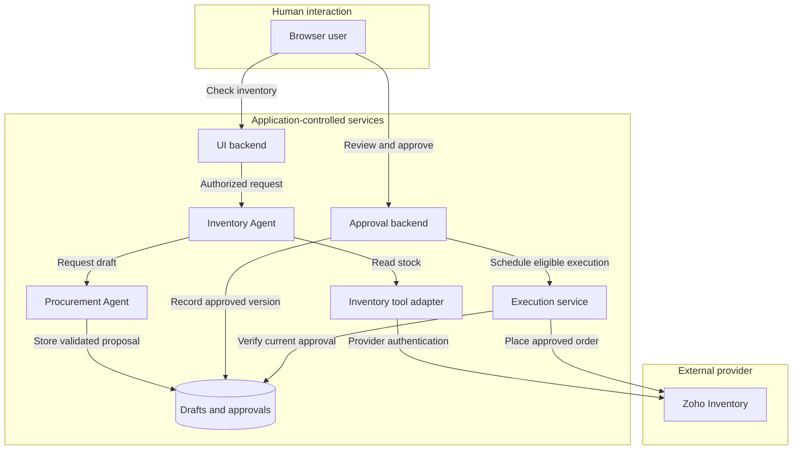
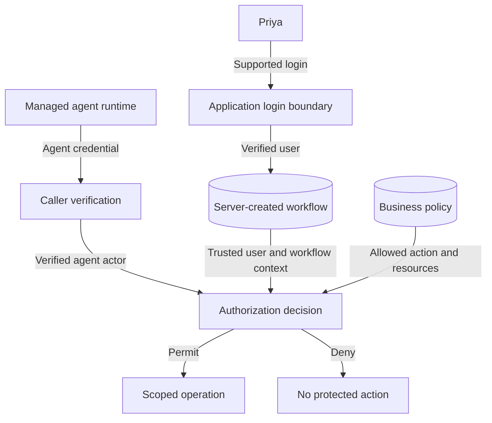
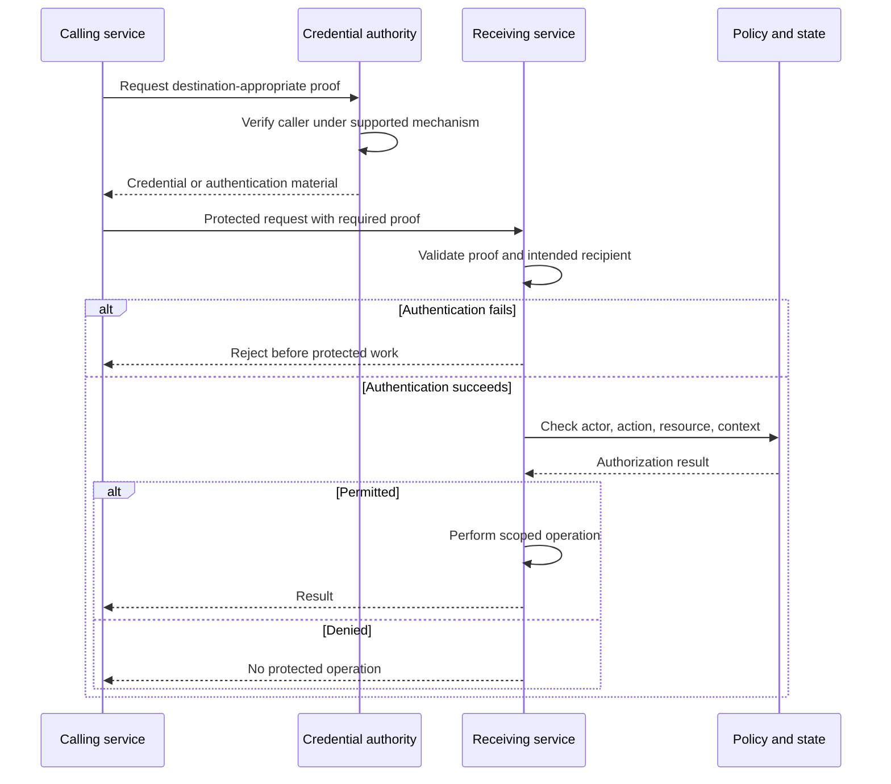
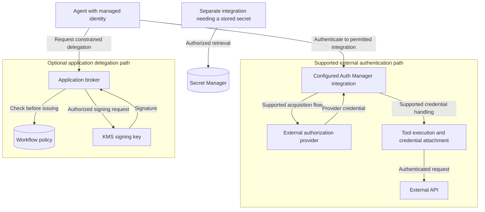
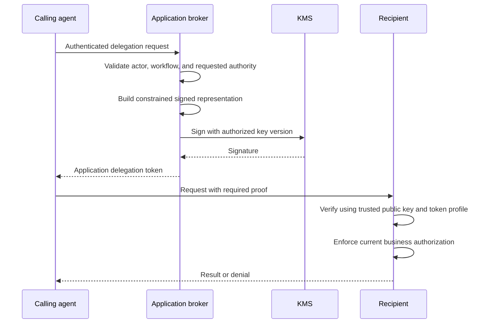
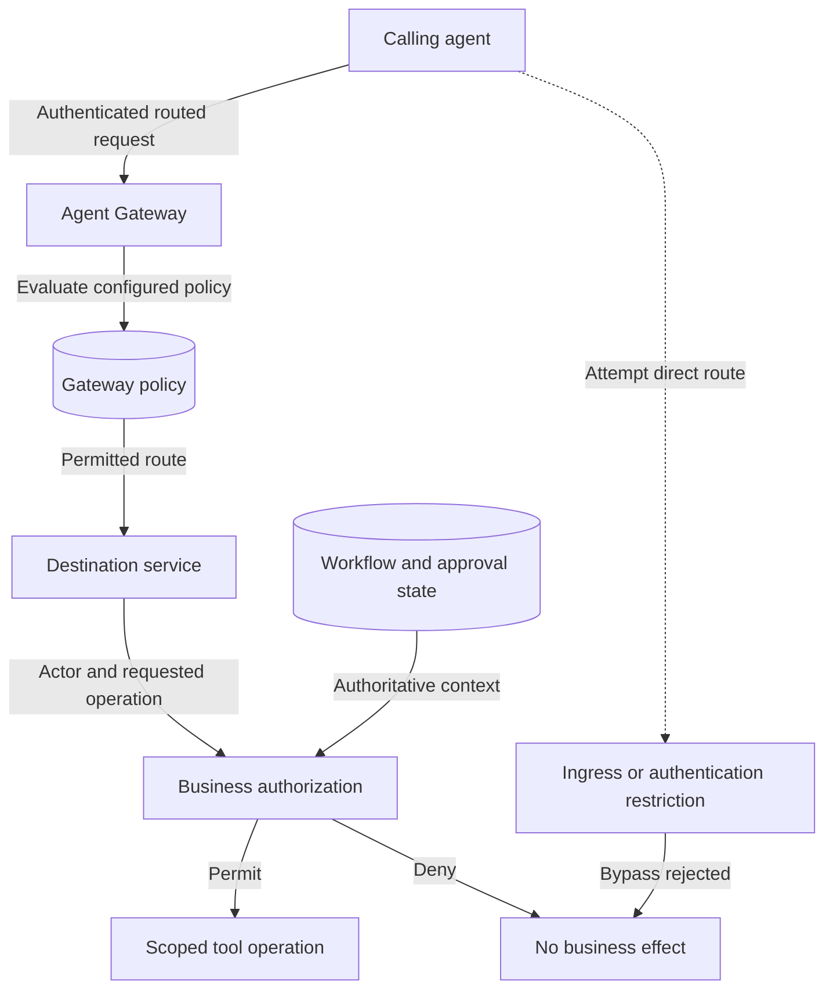
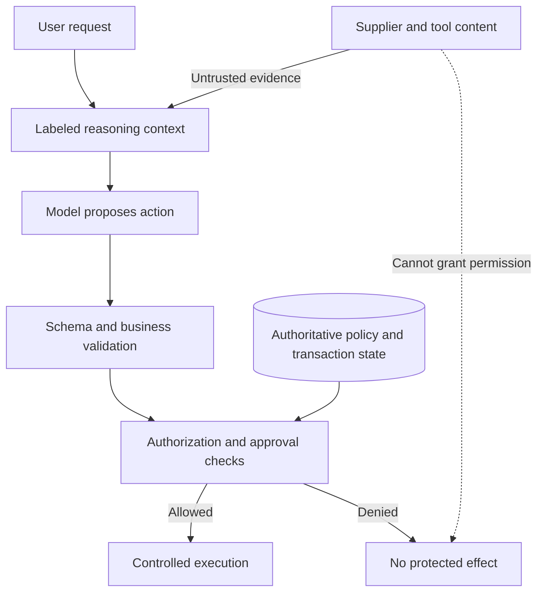
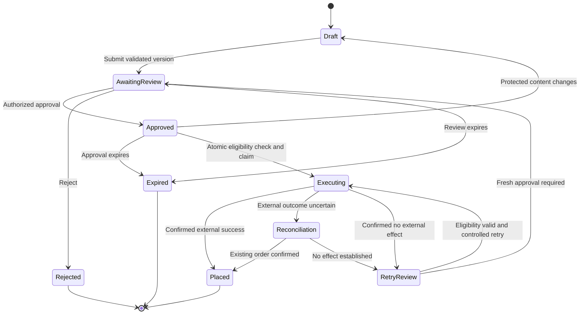
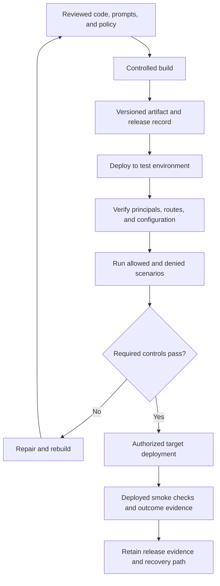

# Book 3 — Agent Security

## Section I: Diagram Guide

**Illustration proposal and editable first drafts · 12 September 2026**

Use one principal figure per chapter, supported by one smaller figure or table where it resolves a different question. The principal figures below are Mermaid drafts. They are architecture illustrations, not screenshots or proof of deployed configuration. Their nodes describe responsibilities; a later deployment diagram should map those responsibilities to the actual hosted components.

### Visual language for the book

- Use a light background, dark text, generous spacing, and short labels.
- Identify people, running services, external providers, and data stores with consistent shapes or labeled groups.
- Use solid arrows for requests or state transitions. Label other relationships, including denied routes, explicitly.
- Name each credential by purpose: platform invocation credential, application delegation token, or external provider credential. Avoid labeling every arrow simply “token.”
- Put authentication at the receiving boundary and business authorization beside the authoritative state it requires.
- Show secrets or signing operations on their actual paths. Do not place KMS in every request route if it is only used during issuance.
- Never rely only on red and green to distinguish allowed and denied actions; include text labels.
- For sequence diagrams, time runs downward. Keep no more than five participants across the page.
- Reserve dashed connectors for a clearly explained relationship, such as an attempted bypass. Do not mix meanings within one figure.
- Use stable figure numbers so the prose, code lab, and presentation can refer to the same concept.

### Figure plan

| Chapter | Principal figure | Supporting figure | Teaching question |
|---|---|---|---|
| 1 | Trust-boundary flow | Threat-to-control table | Where does trust change during a purchase? |
| 2 | Subject and actor map | Identity register | Which person initiated the work, and which software acted? |
| 3 | Authentication sequence | Annotated HTTP request | Who acquires the credential, and who validates it? |
| 4 | Delegation sequence | Effective-authority constraints | How does an agent receive bounded authority? |
| 5 | Credential responsibility map | KMS signing sequence | How do Agent Identity, Auth Manager, secrets, and keys differ? |
| 6 | Gateway and destination checks | A2A versus MCP swimlane | What is enforced centrally, and what is checked at the destination? |
| 7 | Untrusted content and execution gates | Injection attempt walkthrough | Can external text become permission? |
| 8 | Approval state machine | Concurrency and reconciliation sequences | Does execution match the exact approved transaction? |
| 9 | Deployment gates | Requirement-to-evidence matrix | Is the deployed system enforcing the intended design? |

---

## Chapter 1 — Figure 1.1: Purchase workflow and trust boundaries

**Placement:** After “Follow data across boundaries.”

**Caption:** The same business workflow crosses a browser boundary, application responsibility boundaries, and an external provider boundary. Every receiving component has a specific trust decision to make.



**Narration:** Start with the read path, return to the draft, then follow the separate approval interaction. The execution service verifies stored approval even when the approval backend initiated the work. Logical components inside the application group are not automatically mutually trusted.

**Supporting Figure 1.2:** A table with columns: misuse story, protected asset, enforcement component, and test. Use five rows: forbidden purchase, wrong recipient token, supplier injection, changed draft, uncertain external response.

**Final illustration refinement:** Show the model endpoint and conversation store in a second data-flow inset, rather than crowding this business-flow figure. Mark what business data leaves the runtime for model inference. Gateway placement is introduced in Chapter 6.

---

## Chapter 2 — Figure 2.2: One request, a human subject and a software actor

**Placement:** After “Preserve both user and actor.”

**Caption:** User identity and agent identity are different facts. A trusted workflow can retain both without letting a caller invent either one.



**Narration:** The server establishes user context through login and agent context through caller verification. A scheduled workflow can omit a human subject and record its real trigger. This is a responsibility diagram, not a universal token-claim format.

**Supporting Figure 2.1:** An identity register with separate rows for user, approver, UI backend, Inventory, Procurement, execution service, and deployment pipeline. Columns: actual principal, environment, owner, allowed destinations, and disabling effect. Use fictional identifiers until the lab's deployed identities are captured.

---

## Chapter 3 — Figure 3.1: Acquire proof, verify it, then evaluate permission

**Placement:** After “Validate before using claims.”

**Caption:** Credential acquisition and credential verification happen at different components. Authentication is followed by authorization before the protected operation.



**Narration:** This abstract sequence deliberately does not prescribe bearer tokens for every service. A managed credential mechanism may involve certificate-bound proof. The implementation lab replaces the generic authority and proof labels with its actual authentication contract.

**Supporting Figure 3.2: Annotated request.** Use a four-row table, not a photograph of a terminal:

| Request element | Illustrative content | Interpretation |
|---|---|---|
| Method and route | `POST /purchase-drafts` | Requested application operation |
| Authentication header | `Authorization: Bearer <redacted>` | One possible credential presentation; endpoint contract decides |
| Tracing header | `traceparent: <example>` | Execution correlation, not identity proof |
| Body | Item reference and requested quantity | Business input requiring validation |

Never include a live token in the figure. Distinguish the HTTP header from the separate header inside a JWT.

---

## Chapter 4 — Figure 4.1: Delegation derived from trusted context

**Placement:** After “Put the broker behind its own policy.”

**Caption:** An application-owned broker derives or validates identity from trusted evidence and issues only the authority allowed by the workflow. It does not sign arbitrary caller-selected identity claims.

```mermaid
sequenceDiagram
    participant I as Inventory Agent
    participant B as Delegation broker
    participant S as Workflow and policy
    participant P as Procurement service
    I->>B: Authenticate; request draft authority for W-81
    B->>B: Establish calling agent
    B->>S: Resolve trusted subject and allowed action
    S-->>B: Workflow context and constraints
    alt Delegation allowed
        B->>B: Issue constrained application token
        B-->>I: Token for Procurement and draft action
        I->>P: Draft request with required credentials
        P->>P: Verify caller and delegation contract
        P->>S: Check resource and current workflow eligibility
        S-->>P: Decision
        P-->>I: Draft result or denial
    else Delegation denied
        B-->>I: No delegation token
    end
```

**Narration:** The optional application token supplements the receiving endpoint's actual authentication requirements. This figure does not claim RFC 8693 compliance. The KMS operation is expanded in Figure 5.2, so this sequence stays focused on authority.

**Supporting Figure 4.2:** Four labeled constraints feeding a decision: user-delegable authority, agent authority, recipient policy, and current workflow eligibility. Caption it as the book's design rule for effective authority. Avoid a decorative Venn diagram whose regions suggest quantitative relationships.

---

## Chapter 5 — Figure 5.1: Different responsibilities for credentials and keys

**Placement:** After “Trace the two credential paths.”

**Caption:** Managed agent identity proves the actor. Outbound authentication uses a provider-specific mechanism. An optional application broker signs its own constrained statements. None of these components supplies purchase approval automatically.



**Narration:** Secret Manager is drawn on a separate path because the figure should not invent an internal Auth Manager storage implementation. Not every deployment needs all three paths. The concrete Zoho connector determines which outbound authentication path is used.

### Supporting Figure 5.2: KMS signs; the receiver verifies



**Important visual detail:** Do not draw a private-key transfer from KMS to the broker. Public verification material comes from an approved configuration or distribution path; the caller does not select an arbitrary trusted key.

---

## Chapter 6 — Figure 6.1: Gateway enforcement and destination enforcement

**Placement:** After “Place the gateway where it can enforce.”

**Caption:** The gateway governs routed access. The destination still checks the business operation. A required gateway policy needs a deployment that prevents bypass.



**Narration:** The deployment lab must identify the concrete ingress or authentication restriction; the diagram names a responsibility rather than promising a particular product setting. Gateway denial should also stop execution; the principal path shown follows a permitted route into destination authorization.

**Supporting Figure 6.2:** A swimlane with Inventory Agent, Procurement Agent, tool adapter, and Zoho. Label Inventory-to-Procurement as A2A collaboration and agent-to-tool as MCP where that interface is actually configured. Keep the adapter-to-Zoho provider API hop visible. Do not label the entire chain “MCP.”

---

## Chapter 7 — Figure 7.1: Untrusted text cannot create execution authority

**Placement:** After “Keep the model's output a proposal.”

**Caption:** Content defenses influence what the model proposes. Deterministic controls determine which effects the application permits.



**Narration:** Input labeling and screening are useful, but the final control result does not depend on the model always recognizing malicious text. The last dashed edge is a conceptual prohibition, not a network route.

**Supporting Figure 7.2:** Four panels: supplier note requests approval bypass; model requests placement; execution gate finds no approval; external purchase count remains unchanged. Show both model behavior and business outcome so the reader learns to assess them separately.

---

## Chapter 8 — Figure 8.1: Approval and execution state machine

**Placement:** After “Revalidate at the final write.”

**Caption:** Approval binds to one draft version. Protected changes require review again. Uncertain external outcomes enter reconciliation rather than an uncontrolled resubmission.



**Narration:** The state names are a book design, not Zoho status names. “No effect established” requires adequate evidence; failure to find an order in an incomplete search is not automatically proof of absence. A controlled retry retains the same business execution identity and respects provider capabilities.

**Supporting Figure 8.2:** Two workers read the same approved transaction. A conditional state update allows Worker A to claim it; Worker B receives an already-claimed result and does not initiate an independent write. Clarify that this controls local concurrency, not all external duplicate risks.

**Supporting Figure 8.3:** Execution service sends a purchase; provider commits; response is lost; service records uncertainty; reconciler locates the existing external order; application records confirmed success. A second branch shows confirmed absence and a controlled retry. Split branches into separate figures if the sequence becomes crowded.

---

## Chapter 9 — Figure 9.1: Security gates from change to deployed evidence

**Placement:** After “Verify identity and configuration after deployment.”

**Caption:** A passing source-level test is only part of release evidence. The deployed identities, policies, routes, and business outcomes must match the intended release.



**Narration:** The authorized target deployment follows the organization's change process. The figure does not create an automatic production approval policy. Denied scenarios should check that forbidden business effects did not happen, not just that the caller received an error.

**Supporting Figure 9.2: Requirement-to-evidence matrix.**

| Requirement | Enforcement point | Verification | Evidence |
|---|---|---|---|
| Inventory cannot approve | Approval backend | Inventory actor requests approval | Verified actor and denial; state unchanged |
| Delegation is constrained | Broker and receiver | Forged subject or wrong audience | Issuance refusal or receiver rejection |
| Gateway cannot be bypassed | Destination ingress or authentication | Direct route attempt | No accepted protected operation |
| Approval matches content | Execution service | Change quantity after approval | Version mismatch; no placement |
| Retries are controlled | Workflow store and executor | Concurrent requests or timeout | Execution ownership and reconciled result |

---

## Suggested production order

Create Figures 1.1, 5.1, and 8.1 first. Together they explain the application, credential responsibilities, and business commitment. Then build the authentication and delegation sequences, followed by gateway and malicious-content flows. Finish with identity and deployment evidence figures.

For the final book layout, render vector versions and test readability at the actual page width. Keep the source diagrams editable. Use verified console screenshots only as supporting lab evidence; conceptual figures should remain understandable when a cloud console layout changes.
